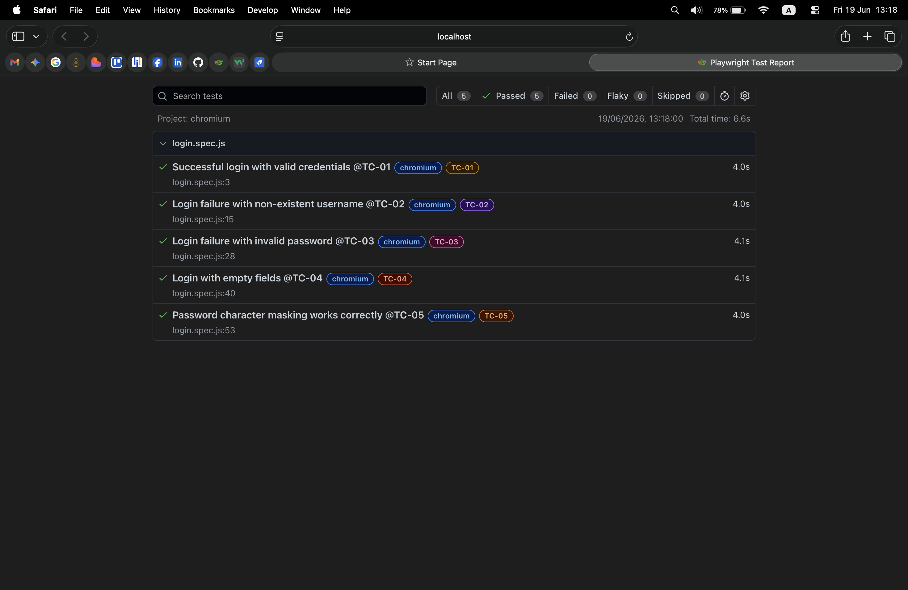

# Swag Labs Login Automation Test Suite

This mini-project contains an automated test suite targeting the authentication flows of the Swag Labs demo application. It is built using **Playwright** and **JavaScript**, utilizing custom test tags to tie automated results back to structured test design.

---

| ID Tag | Scenario Description | Expected System Behavior | Target Elements / Locators |
| :--- | :--- | :--- | :--- |
| **`@TC-01`** | Successful Login (Happy Path) | Redirects user to `/inventory.html` portal page. | `[data-test="username"]`, `[data-test="password"]`, `[data-test="login-button"]` |
| **`@TC-02`** | Login Failure (Invalid Username) | Form submission halts; displays "Epic sadface: Username and password do not match any user in this service" error banner. | `[data-test="error"]` |
| **`@TC-03`** | Login Failure (Invalid Password) | Form submission halts; displays "Epic sadface: Username and password do not match any user in this service" error banner. | `[data-test="error"]` |
| **`@TC-04`** | Login Failure (Empty Fields) | Form submission halts; displays "Epic sadface: Username is required" warning banner. | `[data-test="error"]` |
| **`@TC-05`** | Password Masking Check | Password string input characters are securely masked by the web browser interface. | `[data-test="password"]` input `type="password"` attribute |                                   |

---

## How to Run the Suite

Follow these setup steps to execute the automation tests and generate the dynamic status locally:

1. **Install required framework packages:**
   npm install

2. **Execute all 5 automated tests:**
   npx playwright test --project=chromium

3. **Execute a single test case using tag:**
   npx playwright test --grep {tag} --project=chromium
   Ex: npx playwright test --grep @TC-01 --project=chromium

## Test Execution Proof

Below is the live execution report generated by the Playwright HTML Reporter, proving all 5 core test cases match our design specs and pass successfully:

