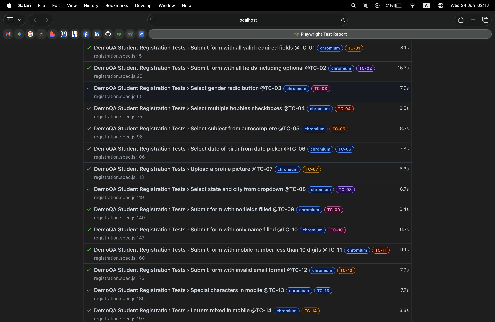

# DemoQA Student Registration Form Test Cases

This mini-project contains an automated test suite targeting the student registration form flows of the DemoQA demo application. It is built using **Playwright** and **JavaScript**, following the Page Object Model pattern with structured test data and dynamic methods to handle complex UI interactions such as date pickers, autocomplete inputs, and chained dropdowns.

---

| ID Tag | Scenario Description | Type | Precondition | Expected System Behavior | Target Elements |
| :--- | :--- | :--- | :--- | :--- | :--- |
| **`@TC-01`** | Submit form with all valid required fields | Positive | App is open, form is empty | Success modal appears with confirmation message | First name, last name, gender radio, mobile input, submit button |
| **`@TC-02`** | Submit form with all fields including optional | Positive | App is open, form is empty | Success modal shows all submitted values correctly | All form fields, date picker, subject autocomplete, hobbies, file upload, state/city dropdown |
| **`@TC-03`** | Select gender radio button | Positive | App is open, form is empty | Only selected gender is checked, previously selected gender is deselected | Gender radio buttons |
| **`@TC-04`** | Select multiple hobbies checkboxes | Positive | App is open, form is empty | All selected hobbies checked simultaneously, unchecked hobby removed | Hobbies checkboxes |
| **`@TC-05`** | Select subject from autocomplete | Positive | App is open, form is empty | Selected subjects appear as tags in subject field | Subject autocomplete input |
| **`@TC-06`** | Select date of birth from date picker | Positive | App is open, form is empty | Date of birth input shows selected date in correct format | Date picker, month/year dropdowns, calendar grid |
| **`@TC-07`** | Upload a profile picture | Positive | App is open, form is empty | File name appears confirmed in upload input | File upload input |
| **`@TC-08`** | Select state and city from chained dropdown | Positive | App is open, form is empty | City options update based on selected state, previously selected city not present in DOM | State dropdown, city dropdown |
| **`@TC-09`** | Submit form with no fields filled | Negative | App is open, form is empty | Form blocked from submitting, success modal does not appear | Submit button, success modal |
| **`@TC-10`** | Submit form with only name filled | Negative | App is open, form is empty | Form blocked from submitting, name field values retained | First name, last name, submit button, success modal |
| **`@TC-11`** | Submit form with mobile less than 10 digits | Negative | App is open, all required fields filled except valid mobile | Form blocked from submitting, success modal does not appear | Mobile input, submit button, success modal |
| **`@TC-12`** | Submit form with invalid email format | Negative | App is open, all required fields filled except valid email | Form blocked from submitting, success modal does not appear | Email input, submit button, success modal |
| **`@TC-13`** | Special characters in mobile number | Boundary | App is open, all required fields filled except valid mobile | Form blocked from submitting, success modal does not appear | Mobile input, submit button, success modal |
| **`@TC-14`** | Letters mixed in mobile number | Boundary | App is open, all required fields filled except valid mobile | Form blocked from submitting, success modal does not appear | Mobile input, submit button, success modal |

---

## How to Run the Suite

1. **Install required framework packages:**
```bash
   npm install
```

2. **Execute all 14 automated tests:**
```bash
   npx playwright test --project=chromium
```

3. **Execute a single test case using tag:**
```bash
   npx playwright test --grep @TC-01 --project=chromium
```

4. **View the HTML report:**
```bash
   npx playwright show-report
```

## Test Execution Proof

Below is the live execution report generated by the Playwright HTML Reporter, proving all 14 test cases match our design specs and pass successfully:

