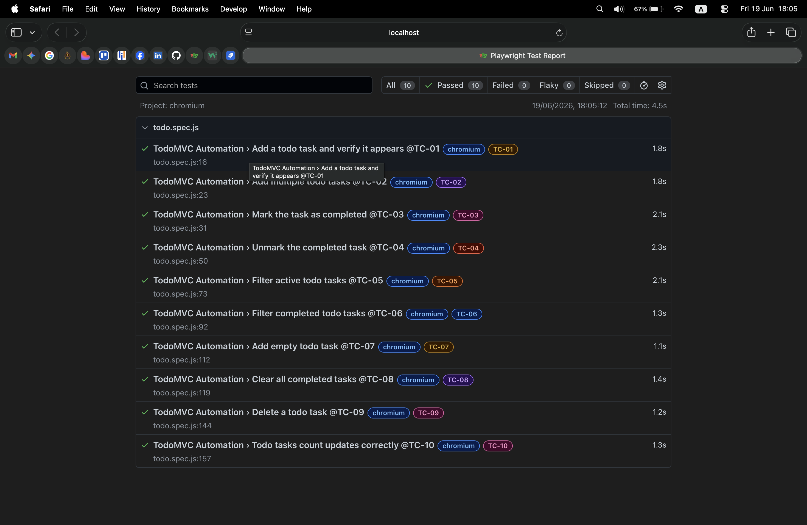

# TodoMVC Test Cases

This mini-project contains an automated test suite targeting the core task management flows of the TodoMVC React demo application. It is built using **Playwright** and **JavaScript**, following the Page Object Model pattern with structured test data to ensure maintainability and scalability.

---

| ID Tag | Scenario Description | Type | Precondition | Expected System Behavior | Target Elements |
| :--- | :--- | :--- | :--- | :--- | :--- |
| **`@TC-01`** | Add a todo task and verify it appears | Positive | App is open, todo list is empty | Task appears in the list, count = 1 | Text input, todo item label |
| **`@TC-02`** | Add multiple todo tasks | Positive | App is open, todo list is empty | All 5 tasks appear in correct order, count = 5 | Text input, todo item label |
| **`@TC-03`** | Mark the task as completed | Positive | App is open, 2 tasks added | Completed task visible in completed section, active task visible in active section | Toggle checkbox, filter links, todo item label |
| **`@TC-04`** | Unmark the completed task | Positive | App is open, 2 tasks added, one marked complete | Unmarked task moves back to active section, count = 2 in active | Toggle checkbox, filter links, todo item label |
| **`@TC-05`** | Filter active todo tasks | Positive | App is open, 5 tasks added, 3 marked complete | Only 2 active tasks shown, 3 completed tasks not present in DOM | Toggle checkbox, active filter link, todo item label |
| **`@TC-06`** | Filter completed todo tasks | Positive | App is open, 5 tasks added, 3 marked complete | Only 3 completed tasks shown, 2 active tasks not present in DOM | Toggle checkbox, completed filter link, todo item label |
| **`@TC-07`** | Add empty todo task | Negative | App is open, todo list is empty | No task added to list, input field remains empty | Text input, todo item label |
| **`@TC-08`** | Clear all completed tasks | Positive | App is open, 5 tasks added, 3 marked complete | Completed tasks removed, 2 active tasks remain untouched | Toggle checkbox, clear completed button, filter links, todo item label |
| **`@TC-09`** | Delete a todo task | Positive | App is open, 2 tasks added | Targeted task deleted, count = 1, second task untouched | Delete button, todo item label |
| **`@TC-10`** | Todo tasks count updates correctly | Positive | App is open, todo list is empty | Counter reflects correct active count after every action | Todo count, toggle checkbox, delete button, text input |

---

## How to Run the Suite

Follow these setup steps to execute the automation tests and generate the dynamic status locally:

1. **Install required framework packages:**
   npm install

2. **Execute all 10 automated tests:**
   npx playwright test --project=chromium

3. **Execute a single test case using tag:**
   npx playwright test --grep {tag} --project=chromium
   Ex: npx playwright test --grep @TC-01 --project=chromium

4. **View the HTML report:**
   npx playwright show-report

## Test Execution Proof

Below is the live execution report generated by the Playwright HTML Reporter, proving all 10 core test cases successfully:

